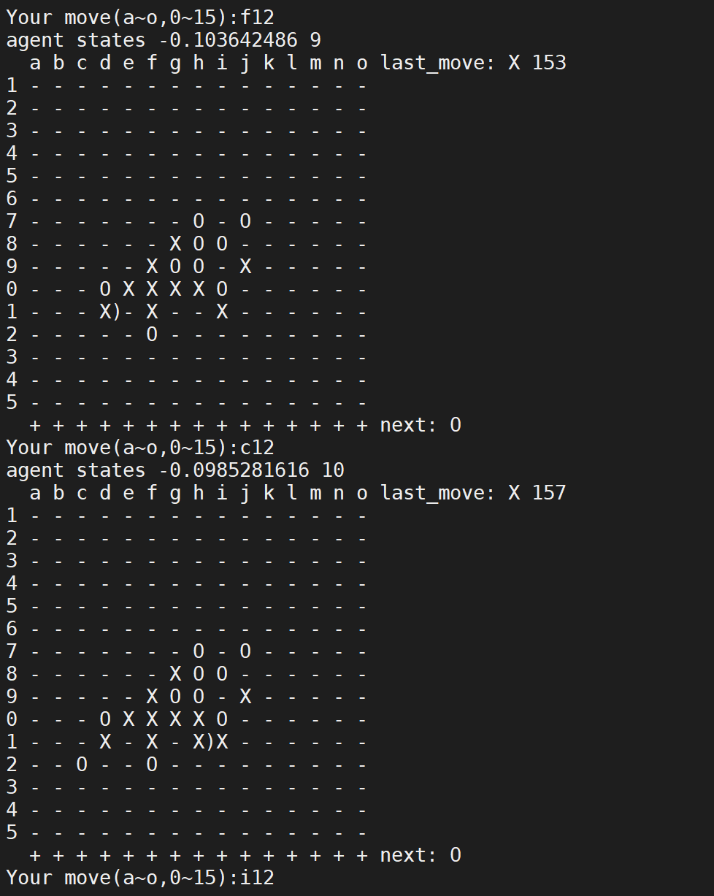

# INTRODUCTION
This repo implement an Gomoku AI by selfplay, the main code is modified from [seed-rl](https://github.com/google-research/seed_rl).

I have trained an model that got 90% winrate vs rule AI (from an open source repo).


Training info: RTX2070 / I7-9700 / 2~3day / 2G-frame-sample

[Download Checkpoint]()


# HOW TO USE
## 1. install nvidia-docker
https://github.com/NVIDIA/nvidia-docker

## 2. build docker container
```
cd docker
bash build.sh
```

## 3. train

```
bash train_local.sh
```
Accessing Tensorboard Monitor during the training: [localhost:6006](localhost:6006).


## 4. try to play with it

```
bash play_local.sh #CHECKPOINT PATH(eg: 1588068127/ckpt-124)#
```